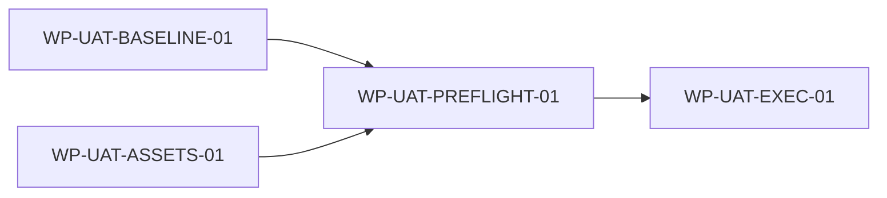

# [UAT_00] 单体 Agent 用户验收测试计划

## 1. 文档信息

| 项目 | 内容 |
|---|---|
| 文档标识 | `PLAN-UAT-001` |
| 文档编号 | `UAT_00` |
| 文档类型 | 设计驱动实施计划 |
| 文档状态 | In Review（UAT 准入已完成，待用户执行验收） |
| 当前版本 | v0.2 |
| 日期 | 2026-08-24 |
| 目标计划路径 | `docs/plans/UAT_00_SINGLE_AGENT_ACCEPTANCE_TEST_PLAN.md` |
| 适用范围 | 单体 Agent 公共查询入口、Knowledge、Employee、Transaction、权限、失败语义及扩展保护的个人项目验收 |
| 非范围 | 生产部署、生产 SLA、Multi-Agent、写操作、聚合查询、知识录入、业务结果外部模型出域、重新执行真实 DeepSeek/P5 |
| 权威顺序 | 用户范围 → 仓库规则 → `REQ_00` → L0/L1 → L2 → 当前实现与测试证据 → 本计划 |
| 实施授权 | 本计划的 Ready 不等于实施授权；仅表示用户可以开始 UAT，不授权生产启用、真实模型调用、数据写入或 Git 操作 |

## 2. 修改历史

| 序号 | 日期 | 位置 | 原因 | 修改内容 |
|---:|---|---|---|---|
| 1 | 2026-08-21 | 全文 | 建立 UAT 准入、执行和退出基线 | 新建 v0.1，复用现有系统 E2E，补充 16 项验收用例目录和只读预检 |
| 2 | 2026-08-24 | 全文 | 完成准入验证并对齐标准计划结构 | 升级 v0.2；统一 Employee 进程变量；关闭基线、资产、预检和模型边界门禁；将 UAT 执行置为 Ready |

## 3. 来源清单与当前基线

| 资源 | 角色 | 层级 | 状态/版本 | 权威范围 | 是否读取 | 置信度 |
|---|---|---|---|---|---|---|
| [`REQ_00`](../REQ_00_SINGLE_AGENT_QUERY_REQUIREMENTS.md) | 需求基线 | Requirements | v1.3 已确认 | `§5` 三类查询、`§7` 权限、`§9～12` 异常/测试/首期验收 | 是 | 高 |
| [`L0_00`](../design/L0_00_SINGLE_AGENT_ARCHITECTURE.md) | 总体架构 | L0 | v1.0 Approved | `§7` 全局不变量、`§8～11` 流程/安全/质量、`§14` 当前保护条件 | 是 | 高 |
| [`L1_00`](../design/L1_00_SINGLE_AGENT_CORE_RUNTIME_ARCHITECTURE.md) | 核心架构 | L1 | v1.0 Approved | Spring/Python 双进程、单动作 Core、组合根与默认 stub 边界 | 是 | 高 |
| [`L1_01`](../design/L1_01_SINGLE_AGENT_KNOWLEDGE_QUERY_ARCHITECTURE.md) | Knowledge 架构 | L1 | v1.0 Approved | 五阶段查询、多域、真实检索和已知效果结论 | 是 | 高 |
| [`L1_02`](../design/L1_02_SINGLE_AGENT_BUSINESS_QUERY_ADAPTER_ARCHITECTURE.md) | Business 架构 | L1 | v1.0 Approved | Employee/Transaction Adapter、业务域最终授权及结果边界 | 是 | 高 |
| [`L2_00_00`](../design/L2_00_00_SINGLE_AGENT_SPRING_ACCESS_RUNTIME_COORDINATION_DETAILED_DESIGN.md) | 接入详细设计 | L2 | v1.1 Approved | 公共/内部契约、错误、健康、配置与测试 | 是 | 高 |
| [`L2_00_01`](../design/L2_00_01_SINGLE_AGENT_CORE_EXECUTION_CAPABILITY_REGISTRATION_DETAILED_DESIGN.md) | Core 详细设计 | L2 | v1.1 Approved | 契约、注册、解析、单动作与验证 | 是 | 高 |
| [`L2_00_02`](../design/L2_00_02_SINGLE_AGENT_DEEPSEEK_MODEL_ACCESS_CONTROLLED_GENERATION_DETAILED_DESIGN.md) | 模型详细设计 | L2 | v1.1 Approved | 默认 stub、显式 DeepSeek、输入和出域边界 | 是 | 高 |
| [`L2_00_03`](../design/L2_00_03_SINGLE_AGENT_USER_ROLE_AUTHORITY_CONVERTER_DETAILED_DESIGN.md) | 权限详细设计 | L2 | v1.1 Approved | ADMIN/VIEWER 映射和未授权失败语义 | 是 | 高 |
| [`L2_01_00`](../design/L2_01_00_SINGLE_AGENT_KNOWLEDGE_QUERY_FLOW_CONFIGURATION_DETAILED_DESIGN.md)、[`L2_01_01`](../design/L2_01_01_SINGLE_AGENT_KNOWLEDGE_RETRIEVAL_LOCAL_MODEL_DETAILED_DESIGN.md)、[`L2_01_02`](../design/L2_01_02_SINGLE_AGENT_KNOWLEDGE_EVIDENCE_EGRESS_SUMMARY_EFFECTIVENESS_DETAILED_DESIGN.md) | Knowledge 详细设计 | L2 | v1.1 Approved | 改写、多域、ES/BGE、证据/摘要、安全与效果结论 | 是 | 高 |
| [`L2_02_00`](../design/L2_02_00_SINGLE_AGENT_BUSINESS_QUERY_COMMON_CONSTRAINTS_CONFIGURATION_EGRESS_DETAILED_DESIGN.md)、[`L2_02_01`](../design/L2_02_01_SINGLE_AGENT_EMPLOYEE_ADAPTER_AUTHORIZATION_DETAILED_DESIGN.md)、[`L2_02_02`](../design/L2_02_02_SINGLE_AGENT_TRANSACTION_ADAPTER_AUTHORIZATION_DETAILED_DESIGN.md) | Business 详细设计 | L2 | v1.1 Approved | 强类型动作、JWT 透传、字段投影与业务契约 | 是 | 高 |
| [`P3_00`](P3_00_SINGLE_AGENT_CODE_IMPLEMENTATION_PLAN.md) | 实施证据索引 | Plan | v1.17 Reviewed | 61 Done、10 Deferred；系统 E2E 已完成；Deferred 业务模型出域不进入 UAT | 是 | 高 |
| `run-system-e2e.ps1` 与 `system-e2e-v1.result.json` | 系统闭环证据 | Implementation | 当前实现 | 真实三 Provider + stub 模型、7 场景、零外部模型调用和零日志泄漏 | 是 | 高 |

当前 UAT 采用“真实三类 Provider + 默认 stub 模型”。现行默认生产入口仍是安全空能力基线；UAT 使用既有测试范围组合根，不据此宣称生产生效。

Knowledge 的有效 P5 结论为 `ineffective`。UAT 可以验证功能链和可用性，不得把结果写成“知识问答效果已达标”。

## 4. 计划原则与范围

1. 工作包是执行和验收单位，来源文档仍是设计权威。
2. 首轮 UAT 验证首期查询闭环、权限、失败语义和架构保护，不重跑历史一次性付费实验。
3. `AGENT_MODEL_PROVIDER` 必须为空或 `stub`；Employee/Transaction 模型出域关闭，外部模型调用上限为 0。
4. Employee 标识和 Transaction 类型仅在执行进程内提供，不写入用例、日志、报告或 Git。
5. UAT 失败只影响验收结论，不自动改变 L0/L1/L2、扩大能力或触发生产修复。

## 5. 工作包清单

| 工作包 ID | 名称 | 来源设计 | 范围 | 直接依赖 | 入口门禁 | 交付物 | 验证 | 回滚边界 | 状态 |
|---|---|---|---|---|---|---|---|---|---|
| `WP-UAT-BASELINE-01` | UAT 代码与证据基线 | 全部 L2 测试章节；`L2_02_00 §15` | 消除历史证据测试对当前源码的误绑定并验证非 live 基线；不修改生产逻辑或历史证据 | - | `GATE-UAT-001` | 测试隔离修复、回归结果 | Python 全量、相关 Java/契约测试、历史哈希 | 回退本工作包测试改动；历史 evidence 字节不变 | Done |
| `WP-UAT-ASSETS-01` | UAT 用例与准入资产 | `REQ_00 §11～12`；各 L2 测试章节 | 建立 16 项机器可读用例、本文、只读预检和资产测试；不建立第二套在线流程 | - | - | 用例目录、预检脚本、直接测试、本文 | 资产严格性、敏感扫描、PowerShell AST | 删除独立 UAT 资产，不影响系统 E2E | Done |
| `WP-UAT-PREFLIGHT-01` | UAT 执行环境准入 | `L2_00_00 §11～12`、`L2_01_01 §12`、三域 L2 安全章节 | 只读核实工具、9200/8908/8909、隔离端口、冲突构建、生产源码和 stub 边界 | `WP-UAT-BASELINE-01`,`WP-UAT-ASSETS-01` | `GATE-UAT-002` | 安全预检输出、执行输入清单 | `run-uat-preflight.ps1 -Mode Preparation` | 不启动服务；失败时保持 UAT 未开始 | Done |
| `WP-UAT-EXEC-01` | 单体 Agent 用户验收执行 | `REQ_00 §12`；全部 L2 验收项 | 先执行系统 E2E，再按 16 项目录完成公共入口验收；不含真实 DeepSeek、业务模型出域或生产启用 | `WP-UAT-PREFLIGHT-01` | `GATE-UAT-004` | UAT 记录、缺陷清单、通过/有条件通过/不通过结论 | 16/16 强制用例、系统 E2E、安全和清理检查 | 停止隔离进程，删除原始日志和进程输入，保留有限结果 | Ready |

## 6. 直接依赖图

| 依赖 ID | 前置工作包 | 后继工作包 | 类型 | 技术依据 | 来源证据 |
|---|---|---|---|---|---|
| `DEP-UAT-001` | `WP-UAT-BASELINE-01` | `WP-UAT-PREFLIGHT-01` | validation | 当前回归基线可信后，环境预检才可成为验收入口证据 | 全部 L2 测试章节；本计划 `GATE-UAT-001` |
| `DEP-UAT-002` | `WP-UAT-ASSETS-01` | `WP-UAT-PREFLIGHT-01` | contract | 预检消费固定用例目录和安全执行 Profile | `REQ_00 §11～12`；本计划 `GATE-UAT-002` |
| `DEP-UAT-003` | `WP-UAT-PREFLIGHT-01` | `WP-UAT-EXEC-01` | runtime | UAT 需要本地检索基础设施、隔离端口和安全模型 Profile | `L2_00_00 §11～12`；`L2_01_01 §12` |

## 7. 阶段门禁

| 门禁 ID | 工作包 | 类型 | 控制动作 | 是否阻塞入口 | 关闭条件 | 证据/权威来源 | 责任方/外部提供方 | 最晚关闭阶段 | 验证者与方法 | 未关闭行为 | 状态 |
|---|---|---|---|---|---|---|---|---|---|---|---|
| `GATE-UAT-001` | `WP-UAT-BASELINE-01` | slice_implementation | 将当前代码作为 UAT 基线 | 是 | Python 全量、相关 Java/契约测试通过；历史 evidence 哈希不变；无生产源码改动 | 测试输出、哈希、`git diff/status` | Codex | 环境预检前 | 自动回归与代码对照设计复核 | 不进入环境准入 | Closed |
| `GATE-UAT-002` | `WP-UAT-PREFLIGHT-01` | integration | 允许启动隔离 UAT 服务 | 是 | Preparation 为 `ready`；9200/8908/8909 可达；8090/9201/9210/8182 空闲；无冲突构建 | 版本化预检输出 | Codex/本地基础设施 | UAT 启动前 | 运行只读预检 | 不启动任何服务 | Closed |
| `GATE-UAT-003` | `WP-UAT-EXEC-01` | integration | 允许发起 Employee/Transaction 成功查询 | 否 | 进程内提供有效 Employee 标识与有结果 Transaction 类型；ADMIN/VIEWER JWT 由真实 auth-service 签发 | Execution 预检、有限调用计数 | 维护者/auth-service/本地数据源 | 首个业务成功用例前 | Execution 预检与人工核实 | 跳过业务成功用例并保持整体 UAT 未完成 | Open |
| `GATE-UAT-004` | `WP-UAT-EXEC-01` | release_effective | 限定模型和数据出域 | 是 | model=stub、business egress=false、external outbound=0；脚本不读取模型密钥 | 用例 Profile、静态测试、预检输出 | Codex | UAT 启动前 | 资产测试、脚本检查、日志扫描 | 检测到真实模型/业务结果出域即 UAT 无效并停止 | Closed |
| `GATE-UAT-005` | `WP-UAT-EXEC-01` | closure | 形成 UAT 结论 | 否 | 16 项强制用例均有结果；无泄漏；隔离进程/原始日志清理；保留 Knowledge `ineffective` 限制 | UAT 有限结果与人工验收 | 维护者/Codex | UAT 结束 | 结果复核 | 保持未通过或有条件通过，不改判 | Open |

## 8. 外部资源与事实

| 资源 ID | 工作包 | 资源/事实 | 提供方 | 开始准备 | 必须完成 | 产物/引用 | 缺失影响 |
|---|---|---|---|---|---|---|---|
| `EXT-UAT-001` | `WP-UAT-PREFLIGHT-01` | ES 9200、BGE Embedding 8908、Rerank 8909 | 本地基础设施 | UAT 准备 | UAT 启动前 | Preparation 预检输出 | Knowledge 用例不可执行 |
| `EXT-UAT-002` | `WP-UAT-EXEC-01` | 有效 Employee 测试标识，进程级 `SYSTEM_E2E_EMPLOYEE_IDENTIFIER` | 维护者 | UAT 准备 | 首个 Employee 成功请求前 | Execution 预检，仅记录存在性 | Employee 成功/权限用例失败关闭 |
| `EXT-UAT-003` | `WP-UAT-EXEC-01` | 有结果 Transaction 类型，进程级 `UAT_TRANSACTION_TYPE` | 维护者/本地数据源 | UAT 准备 | 首个 Transaction 成功请求前 | Execution 预检，仅记录存在性 | Transaction 成功路径不可验收 |
| `EXT-UAT-004` | `WP-UAT-EXEC-01` | ADMIN/VIEWER 用户和随机 HMAC | auth-service/测试启动器 | 启动隔离服务时 | 登录前 | 进程内 JWT、角色响应 | 权限矩阵不可验收 |

`LLM_API_KEY` 不是本轮 UAT 资源；即使操作系统中存在，也不得由本轮脚本读取或使用。

## 9. Ready 队列与执行建议

| 顺序 | 工作包 | 判定 | 未关闭依赖/门禁 | 选择理由 |
|---:|---|---|---|---|
| 1 | `WP-UAT-EXEC-01` | Ready | `GATE-UAT-003` 仅阻塞业务成功用例；`GATE-UAT-005` 为退出门禁 | 基线、资产、静态环境和模型安全边界均已验证，可先启动隔离 UAT，再在首个业务成功用例前提供进程输入 |
| 2 | `WP-UAT-BASELINE-01` | Done | 无 | 当前代码与证据基线已验证 |
| 3 | `WP-UAT-ASSETS-01` | Done | 无 | UAT 用例和只读预检资产已验证 |
| 4 | `WP-UAT-PREFLIGHT-01` | Done | 无 | Preparation 环境准入已通过 |

推荐顺序只用于从 Ready 工作包中选择，不构成新的依赖边。Ready 是计划判定，不等于生产、外部调用、数据修改或 Git 授权。

## 10. 实施交接

| 工作包 | 允许动作 | 禁止动作 | 预期文件/模块 | 来源设计 ID | 测试与验证 | 开放后续门禁 | 建议执行技能 |
|---|---|---|---|---|---|---|---|
| `WP-UAT-BASELINE-01` | 无；交付已完成 | 修改生产逻辑、历史 evidence 或重新绑定历史哈希 | Employee/Transaction 测试辅助代码 | 全部 L2 测试章节 | 已完成 Python/Java/契约回归 | 无 | `code-review-against-docs` |
| `WP-UAT-ASSETS-01` | 无；交付已完成 | 建立第二套在线流程或写入敏感输入 | `agent-runtime/tests/uat`、`run-uat-preflight.ps1`、本文 | `REQ_00 §11～12` | 已完成资产、AST 和安全检查 | 无 | `plan-from-detailed-design` |
| `WP-UAT-PREFLIGHT-01` | UAT 前可重复运行只读预检 | 启动/停止服务、写配置或修改生产源码 | `agent-runtime/scripts/run-uat-preflight.ps1` | `L2_00_00 §11～12`、`L2_01_01 §12` | Preparation/Execution 模式验证 | 无 | `implement-from-detailed-design` |
| `WP-UAT-EXEC-01` | 运行只读预检；设置不回显的进程输入；启动既有隔离系统 E2E；执行 16 项 UAT；生成有限结果；清理本轮进程和原始日志 | 真实 DeepSeek、业务写入、生产启用、持久化标识/JWT、扩大角色/端点/字段、修改历史 evidence | `agent-runtime/scripts/run-system-e2e.ps1`、`agent-runtime/tests/uat/uat_cases.v1.json`、UAT 有限结果目录 | `REQ_00 §12`；各 L2 测试/验收章节 | Preparation/Execution 预检、系统 E2E、16/16 用例、日志/进程清理 | `GATE-UAT-003`,`GATE-UAT-005` | `implement-from-detailed-design` |

验收执行步骤：

1. 运行 `run-uat-preflight.ps1 -Mode Preparation`，记录安全输出中的 HEAD、用例 SHA 和环境状态。
2. 在同一执行进程中设置 `SYSTEM_E2E_EMPLOYEE_IDENTIFIER` 与 `UAT_TRANSACTION_TYPE`，再运行 `-Mode Execution`；不得打印变量值。前者由现有 `run-system-e2e.ps1` 直接消费。
3. 执行 `run-system-e2e.ps1`，确认既有 7 场景、真实三 Provider、stub 模型和清理证据仍通过。
4. 按机器可读目录补充 Viewer、Transaction 成功和公共入口用例；只保留状态、能力 ID、计数和零泄漏结论。
5. 汇总为 `passed`、`conditionally_passed` 或 `failed`；Knowledge 效果限制必须保留。

## 11. 风险与阻塞

| 风险 ID | 工作包 | 类型 | 触发条件 | 影响 | 缓解/解除条件 | 责任方 |
|---|---|---|---|---|---|---|
| `RISK-UAT-001` | `WP-UAT-EXEC-01` | quality | 把 P5 `ineffective` 误写为效果达标 | 形成虚假结论 | 功能闭环与效果结论分开记录 | 验收者 |
| `RISK-UAT-002` | `WP-UAT-EXEC-01` | architecture | 把测试组合根误认为生产入口已启用 | 扩大验收结论 | 明确 UAT 仅使用测试范围组合根 | 验收者 |
| `RISK-UAT-003` | `WP-UAT-EXEC-01` | security | Employee/Transaction 输入进入日志或报告 | 敏感/业务数据泄漏 | 进程输入、日志扫描删除、有限结果 | 执行者 |
| `RISK-UAT-004` | `WP-UAT-EXEC-01` | environment | 端口占用、冲突 Maven 或 ES/Profile 漂移 | 启动错误或证据不可复现 | 预检失败关闭，不停止维护者进程 | 执行者 |
| `RISK-UAT-005` | `WP-UAT-EXEC-01` | cost/security | UAT 意外读取 DeepSeek 密钥 | 未授权付费调用/数据出域 | stub 固定、脚本不引用密钥、outbound=0 | 执行者 |

机器可读目录共 16 项 mandatory：Access 4、Knowledge 3、Employee 4、Transaction 5。通过要求为 16/16 满足 HTTP、语义状态和 capability ID；每请求最多一个能力；业务服务最终授权；无其他业务端点、外部模型调用、敏感持久化或日志泄漏；本轮隔离进程和原始日志清理完成。

## 12. 追踪矩阵

| 工作包 | 来源 REQ/CON/DR | IMPL | TEST | VAL | 交付状态 |
|---|---|---|---|---|---|
| `WP-UAT-BASELINE-01` | `REQ_00 §11`；全部 L2 测试章节 | 历史/当前源码检查隔离、Transaction host import preflight | Python 全量；Transaction Java 全量；相关 Java/契约回归 | 历史 evidence hash、无生产源码 diff | Done |
| `WP-UAT-ASSETS-01` | `REQ_00 §12`；`L0_00 §7～11` | 用例目录、只读预检脚本 | `tests/uat`、PowerShell AST、敏感字面量扫描 | 16 项严格 Profile 与输入占位符 | Done |
| `WP-UAT-PREFLIGHT-01` | `L2_00_00 §11～12`；`L2_01_01 §12` | Preparation/Execution 模式 | Preparation ready；缺输入 Execution blocked | 基础设施/端口/源码/模型/冲突进程检查 | Done |
| `WP-UAT-EXEC-01` | `REQ_00 §12`；各 L2 验收章节 | 复用系统 E2E + 机器可读用例 | 待执行系统 E2E 与 16 项 UAT | 待关闭 `GATE-UAT-003/005` | Ready |

## 13. 自检记录

| 轮次 | 日期 | Blocker | Major | Minor | 已修复 | 遗留 | 停止原因 |
|---:|---|---:|---:|---:|---|---|---|
| 1 | 2026-08-21 | 0 | 0 | 0 | 初版范围、DAG、门禁、外部输入和退出标准已建立 | 待回归和预检后更新状态 | - |
| 2 | 2026-08-24 | 0 | 1 | 2 | 修复计划标准表头/章节、PowerShell 5 根目录解析和用例有限枚举；复用既有 Employee 环境变量；增加冲突构建检查；完成回归和 Preparation | UAT 执行与两项进程输入 | - |

## 14. 当前结论

- Ready 工作包：`WP-UAT-EXEC-01`。
- Blocked 工作包：无。
- In Progress 工作包：无。
- Done 工作包：`WP-UAT-BASELINE-01`、`WP-UAT-ASSETS-01`、`WP-UAT-PREFLIGHT-01`。
- 关键开放门禁：`GATE-UAT-003`（首个业务成功用例前）、`GATE-UAT-005`（UAT 退出）。
- 推荐下一工作包：在用户明确开始 UAT 后执行 `WP-UAT-EXEC-01`；本计划不自动授予真实执行或生产权限。
